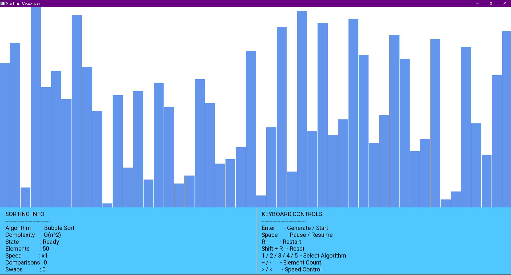
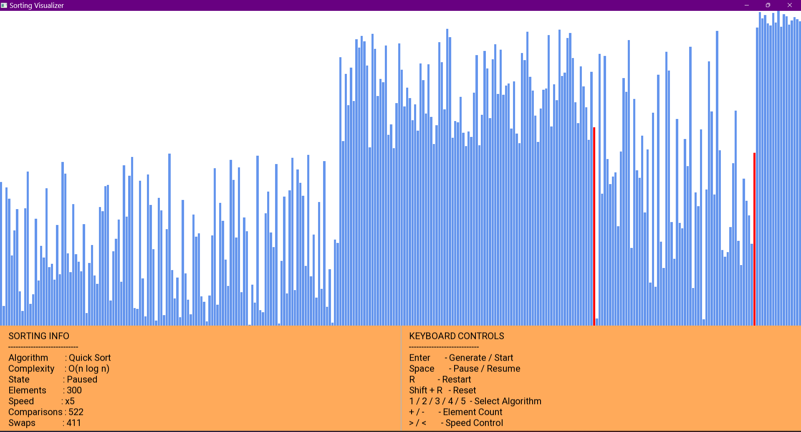
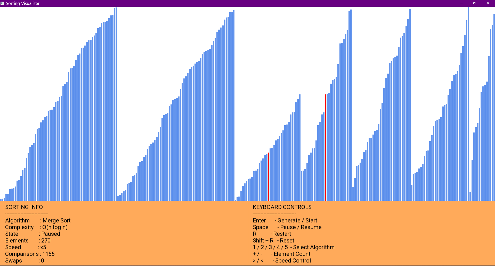

# 🚀 Sorting Algorithm Visualizer (C++ | SFML)

An interactive and modular Sorting Algorithm Visualizer built using **C++** and **SFML**.  
This project demonstrates step-based algorithm execution, dynamic visualization, and performance tracking of multiple sorting algorithms.

---

## 📌 Project Overview

This application visually demonstrates how different sorting algorithms work internally by animating each comparison and swap step.

It is designed using a clean architecture pattern separating:

- **Model** → Array data & statistics
- **Controller** → Sorting execution engine
- **Algorithms** → Individual algorithm implementations
- **Renderer** → Bars and UI rendering

The system supports pause/resume, restart, speed control, and dynamic state transitions.

---

## ✨ Features

- 🔹 Step-based execution engine  
- 🔹 Time-controlled animation using SFML clock  
- 🔹 Pause / Resume functionality  
- 🔹 Restart & Reset system  
- 🔹 Dynamic speed control  
- 🔹 Sorted region highlighting  
- 🔹 Active comparison highlighting  
- 🔹 Performance metrics (Comparisons & Swaps)  
- 🔹 Modular and extensible architecture  

---

## 🧠 Implemented Algorithms

- ✅ Bubble Sort
- ✅ Selection Sort
- ✅ Insertion Sort
- ✅ Quick Sort (Iterative implementation)
- ✅ Merge Sort (Bottom-up iterative implementation)

---

## 🎮 Controls

| Key | Action |
|------|--------|
| Enter | Generate array / Start sorting |
| Space | Pause / Resume |
| R | Restart current algorithm |
| Shift + R | Full Reset |
| 1 / 2 / 3 / 4 / 5 | Select Algorithm |
| + / - | Increase / Decrease number of elements |
| > / < | Increase / Decrease speed |

---

## 🖼 Screenshots

### 🔹 Main Interface

---

### 🔹 Quick Sort Visualization

---

### 🔹 Merge Sort Visualization

---

## 🎥 Demo Video

You can watch the demo video here:

[▶ Watch Demo](screenshots/demo.gif)

---

## 🏗 Project Structure
sorting-visualizer/
│
├── src/
│ ├── app/
│ ├── core/
│ ├── data/
│ ├── algorithms/
│ ├── render/
│ └── main.cpp
│
├── assets/
│ └── fonts/
│
├── screenshots/
├── README.md
└── .gitignore

---

## ⚙️ Build Instructions (Windows - MinGW)

1. Install SFML
2. Compile using:g++ -std=c++17 -IC:/SFML/include src/main.cpp src/app/Application.cpp src/data/ArrayModel.cpp src/render/BarRenderer.cpp src/algorithms/*.cpp src/core/SortController.cpp src/render/UIOverlay.cpp -LC:/SFML/lib -lsfml-graphics -lsfml-window -lsfml-system -o build/sorting-visualizer.exe
3. Make sure required SFML `.dll` files are in the build directory.

---

## 📈 Learning Outcomes

- Converted recursive algorithms into iterative state-machine implementations.
- Designed time-based animation engine.
- Implemented modular and scalable architecture.
- Managed algorithm lifecycle safely with restart/reset handling.
- Built custom visualization logic for divide-and-conquer algorithms.

---

## 📌 Future Improvements

- Heap Sort
- Shell Sort
- Comparison mode (side-by-side algorithms)
- Theme system
- Sound effects
- Web version using Emscripten

---

## 👨‍💻 Author

Ayush Raj Chauhan  
GitHub: https://github.com/AyushRaj1329

---

⭐ If you found this project interesting, consider giving it a star!
